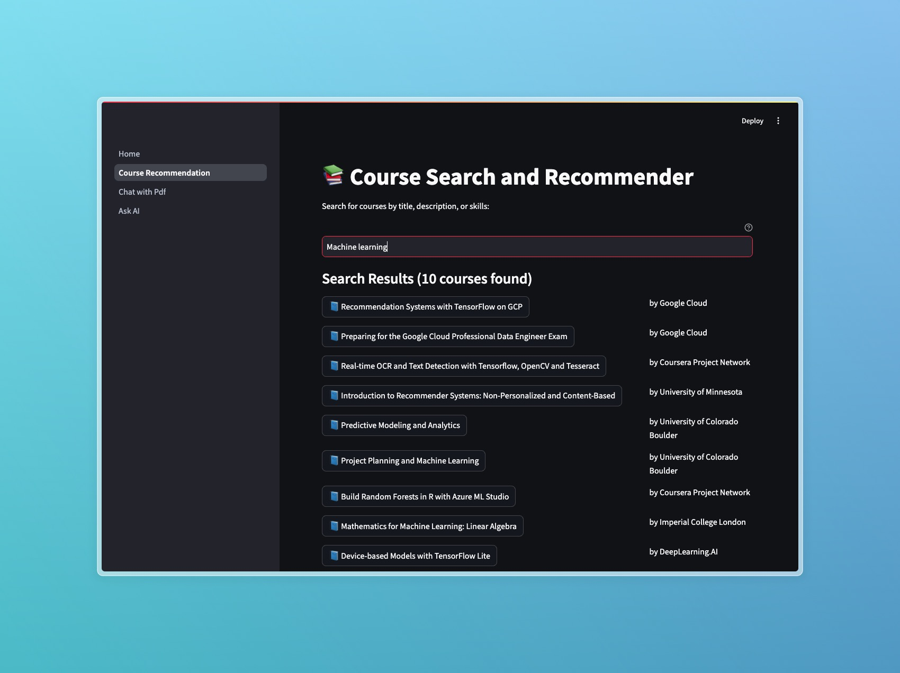
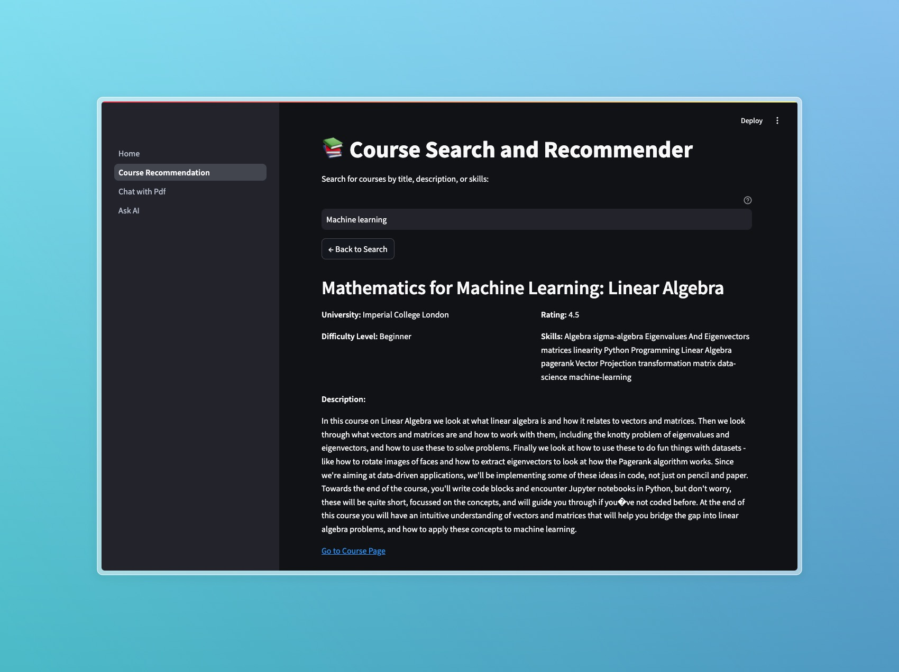
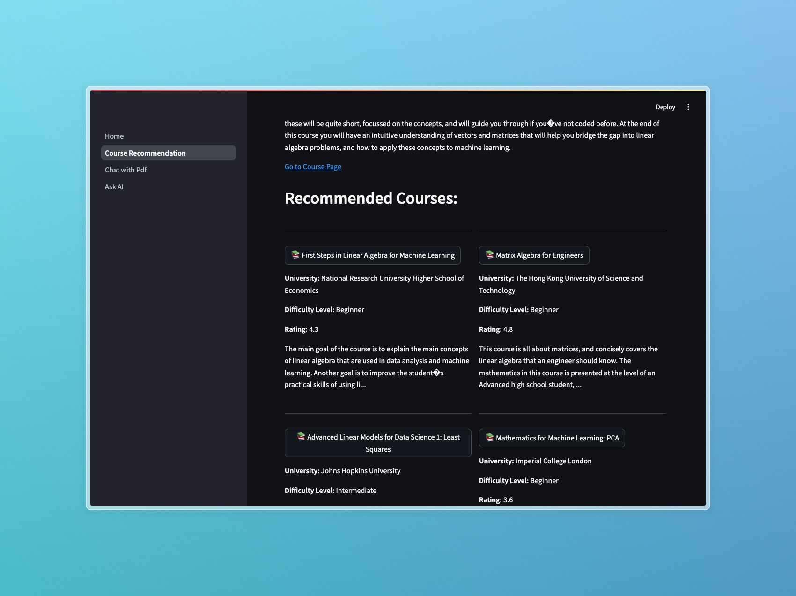
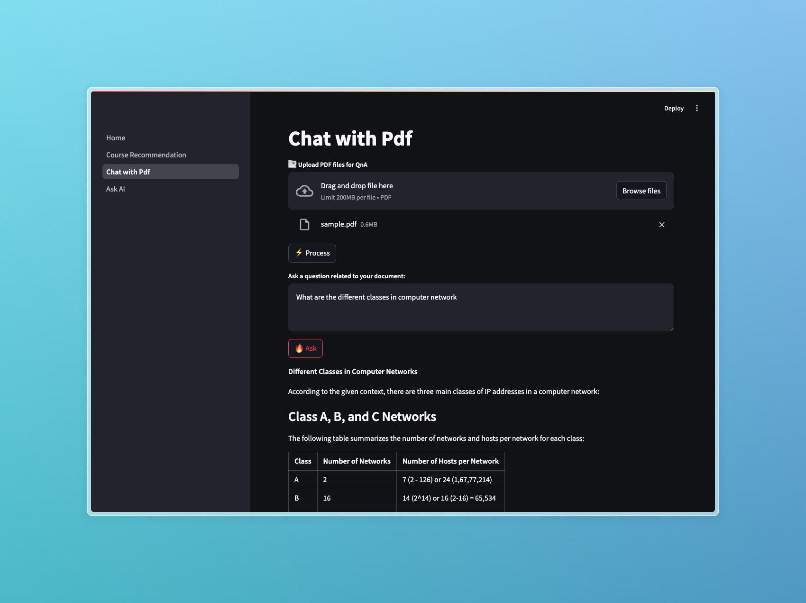

# Smart AI Learning Assistant

An AI-powered learning platform offering intelligent features to enhance your learning experience. Built using **Streamlit** and designed for accessibility, it integrates advanced AI capabilities to assist learners in various ways.

## Table of Contents

- [About the Project](#about-the-project)
- [Features](#features)
- [Tech Stack](#tech-stack)
- [Installation](#installation)
- [Usage](#usage)
- [Screenshots](#screenshots)
- [Future Scope](#future-scope)

## About the Project

The **Smart AI Learning Assistant** is designed to transform the way learners interact with educational content. With AI-powered search, chat, and recommendation features, the platform enables efficient and personalized learning experiences.

## Features

### 1. Course Search and Recommendation

- Search for courses by:
  - Title
  - Description
  - Skills
- Receive personalized course recommendations tailored to your learning goals.

### 2. Chat with PDF

- Upload PDF documents and interact with them through a chatbot.
- Extract insights, ask questions, and summarize content within the document.

### 3. AI Chatbot

- General-purpose chatbot powered by the **ollama:llama3.2:3b** model.
- Ideal for answering questions, brainstorming, and general use cases.

## Tech Stack

### Frontend

- **Streamlit**: For creating an intuitive and user-friendly interface.

### Backend

- **Python**: Core language for backend logic.
- **ollama:llama3.2:3b**: AI model powering the chatbot.

### Additional Libraries

- **PyPDF2**: For PDF parsing.
- **scikit-learn**: For recommendation engine.
- **langchain**: For chat with pdf

## Installation

1. Clone the repository:

   ```bash
   git clone https://github.com/asadsid004/Smart-AI-Learning-Companion.git
   cd Smart-AI-Learning-Companion
   ```

2. Install dependencies:

   ```bash
   pip install -r requirements.txt
   ```

3. Make sure ollama is installed and running. Download llama3.2:3b model

4. Run the Streamlit application:

   ```bash
   streamlit run Home.py
   ```

   Access your site at: http://localhost:8501

## Usage

1. Launch the application in your browser.
2. Use the **Course Search and Recommendation** feature to find and explore courses.
3. Upload PDFs and interact with them using the **Chat with PDF** feature.
4. Engage with the **AI Chatbot** for general inquiries and brainstorming.

## Screenshots

1. Home Page:


2. Course Search and Recommendation:





3. Chat with PDF:



4. AI Chatbot:


## Future Scope

- **Advanced Recommendations**: Improve course recommendations using collaborative filtering.
- **Multi-Document Chat**: Enable interactions with multiple PDFs simultaneously.
- **Progress Tracking**: Allow users to monitor their learning progress over time.
- **Multilingual Support**: Enhance chatbot capabilities for multiple languages.

---

Happy Learning! 🚀
